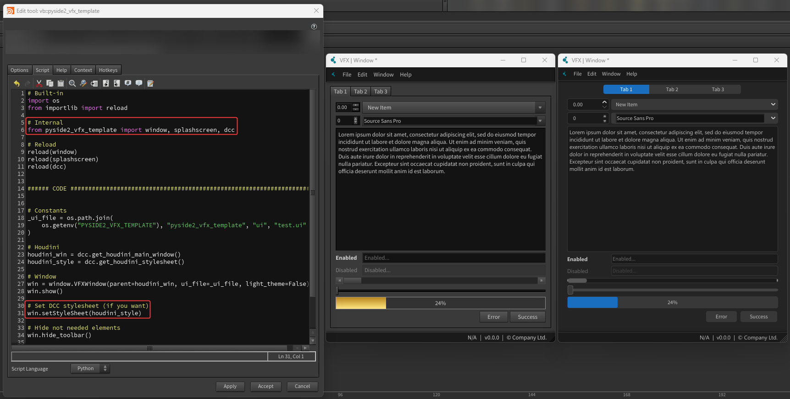
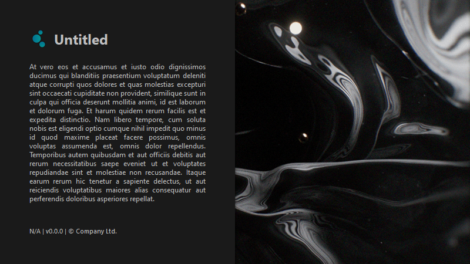
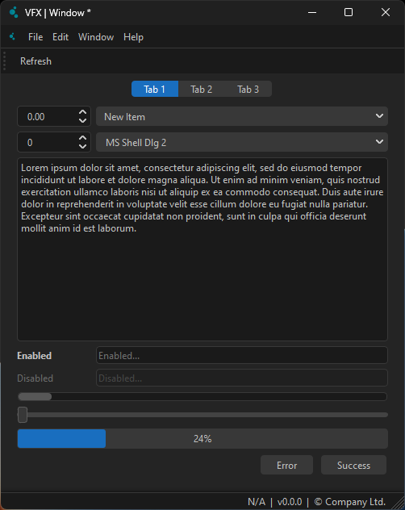

<p align="left">
  <a href="https://www.python.org">
  </a>
  </a>
  </a>
  </a>
  </a>
</p>

<div align="center">

  
  

  <h3 align="center">PySide2 VFX Template</h3>

  <p align="center">
    Custom Python classes and utilities tailored for PySide2 built UI, in VFX-oriented DCC applications.
    <br/>
    <br/>
    <br/>
  </p>

</div>


<!-- TABLE OF CONTENTS -->
## Table of Contents
<!--ts-->
- [Table of Contents](#table-of-contents)
- [About](#about)
- [Installation](#installation)
- [Example](#example)
- [Documentation](#documentation)
- [Gallery](#gallery)
- [Contact](#contact)
<!--te-->


<!-- ABOUT -->
## About

Custom Python classes and utilities tailored for PySide2 built UI, in VFX-oriented DCC applications.


<!-- INSTALLATION -->
## Installation

``` shell
pip install pyside2-vfx-template
```

> [!IMPORTANT]
> In order to have access to the module, make sure to add `pyside2_vfx_template` to the `$PYTHONPATH` of the DCCs. For Houdini, you can find the [houdini_package file](./houdini_package.json).


<!-- EXAMPLE -->
## Example

After installing PySide2 VFX Template, you can run the demo:

``` shell
python example.py
```
Or:
``` python
from pyside2_vfx_template import example

example.main()
```

Here's how it would like like launched from Houdini:



> [!NOTE]
> As you can see, you can still load the DCC stylesheet if you want, but the toolbar, menu bar and statusbar will remain with a custom stylesheet.


<!-- DOCUMENTATION -->
## Documentation

Please read the full documentation [here](https://healkeiser.github.io/pyside2_vfx_template/).


<!-- GALLERY -->
## Gallery

Splash Screen      |  Main Window
:-------------------------:|:-------------------------:
  |  


<!-- CONTACT -->
## Contact

Project Link: [PySide2 VFX Template](https://github.com/healkeiser/pyside2_vfx_template)

<p align='left'>
  <a href="https://www.linkedin.com/in/valentin-beaumont">
  </a>
  <a href="https://www.behance.net/el1ven">
  </a>
  <a href="https://twitter.com/valentinbeaumon">
  </a>
  <a href="https://www.instagram.com/val.beaumontart">
  </a>
  <a href="https://healkeiser.gumroad.com/subscribe">
  </a>
</p>

[](https://www.buymeacoffee.com/healkeiser)

