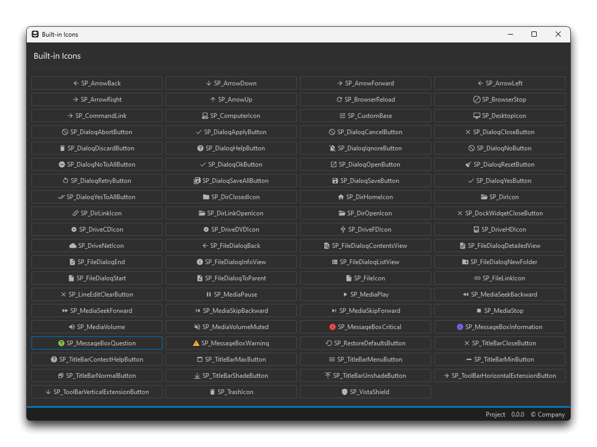

# :material-book:{.scale-in-center} How-to

## Style an Existing Application

In the case where you already have made some custom applications, and don't want to be bothered by subclassing the widgets inside the [fxwidgets](fxwidgets.md) module but still want all applications to look and feel the same, you can call the `fxstyle.load_stylesheet()` function and apply the returned stylesheet to your current application/widget.

```python
from qtpy.QtWidgets import QApplication
from fxgui import fxstyle

application = QApplication([])
application.setStyleSheet(fxstyle.load_stylesheet())
```

```python
from qtpy.QtWidgets import QMainWindow
from fxgui import fxstyle

window = QMainWindow()
window.setStyleSheet(fxstyle.load_stylesheet())
```

!!! note
    You can set this stylesheet on a `QMainWindow`, `QWidget`, etc.

!!! note
    You can pass extra arguments to the [load_stylesheet()](fxstyle.md) function.

## Create a Custom Theme

fxgui uses a JSONC (JSON with comments) file to define all theme colors. You can create your own custom themes by creating a new JSONC file with your color definitions.

### Understanding the Theme Structure

The default `style.jsonc` file contains several sections:

```jsonc
{
    // Feedback colors for status messages
    "feedback": {
        "debug": { "foreground": "#26C6DA", "background": "#006064" },
        "info": { "foreground": "#7661f6", "background": "#372d75" },
        "success": { "foreground": "#8ac549", "background": "#466425" },
        "warning": { "foreground": "#ffbb33", "background": "#7b5918" },
        "error": { "foreground": "#ff4444", "background": "#7b2323" }
    },
    // DCC branding colors
    "dcc": {
        "houdini": "#ff6600",
        "maya": "#38a6cc",
        "nuke": "#fcb434"
    },
    // Theme definitions
    "themes": {
        "dark": { /* ... */ },
        "light": { /* ... */ },
        "my_custom_theme": { /* ... */ }
    }
}
```

### Theme Color Roles

Each theme must define these color roles:

| Role | Description |
|------|-------------|
| `accent_primary` | Primary accent color (buttons, links, selections) |
| `accent_secondary` | Secondary accent (hover states, gradients) |
| `surface` | Main widget background |
| `surface_alt` | Alternate backgrounds (odd rows, secondary surfaces) |
| `input` | Input fields, list backgrounds |
| `tooltip` | Tooltip background |
| `border` | Primary border color |
| `border_subtle` | Subtle/light borders |
| `border_frame` | Frame borders |
| `text` | Primary text color |
| `text_secondary` | Secondary/muted text |
| `text_disabled` | Disabled text |
| `hover` | Hover state background |
| `pressed` | Pressed/checked state background |
| `selected` | Selected item background |
| `disabled` | Disabled widget background |
| `scrollbar_bg` | Scrollbar track |
| `scrollbar_handle` | Scrollbar handle |
| `scrollbar_hover` | Scrollbar handle on hover |
| `separator` | Separator lines |
| `slider_handle` | Slider handle color |
| `slider_hover` | Slider handle on hover |
| `icon` | Icon tint color |

### Creating Your Custom Theme

1. **Copy the default file** as a starting point:

```python
from pathlib import Path
from fxgui import fxconstants

# The default style.jsonc location
default_file = fxconstants.STYLES_FILE
print(f"Default file: {default_file}")

# Copy it to your preferred location
import shutil
custom_file = Path.home() / ".fxgui" / "my_theme.jsonc"
custom_file.parent.mkdir(parents=True, exist_ok=True)
shutil.copy(default_file, custom_file)
```

2. **Add your theme** to the `themes` section:

```jsonc
{
    "themes": {
        "dark": { /* ... existing ... */ },
        "light": { /* ... existing ... */ },
        "monokai": {
            "accent_primary": "#A6E22E",
            "accent_secondary": "#66D9EF",
            "surface": "#272822",
            "surface_alt": "#1e1f1c",
            "input": "#1a1a17",
            "tooltip": "#3e3d32",
            "border": "#49483e",
            "border_subtle": "#75715e",
            "border_frame": "#49483e",
            "text": "#f8f8f2",
            "text_secondary": "#a59f85",
            "text_disabled": "#75715e",
            "hover": "#3e3d32",
            "pressed": "#49483e",
            "selected": "#49483e",
            "disabled": "#3e3d32",
            "scrollbar_bg": "#1e1f1c",
            "scrollbar_handle": "#49483e",
            "scrollbar_hover": "#75715e",
            "separator": "#75715e",
            "slider_handle": "#f8f8f2",
            "slider_hover": "#ffffff",
            "icon": "#f8f8f2"
        }
    }
}
```

### Using Your Custom Theme

```python
from fxgui import fxstyle, fxwidgets

# Set your custom color file BEFORE creating any widgets
fxstyle.set_color_file("/path/to/my_theme.jsonc")

# Check available themes (includes your custom ones)
print(fxstyle.get_available_themes())  # ['dark', 'light', 'monokai']

# Create your application
app = fxwidgets.FXApplication()
window = fxwidgets.FXMainWindow(title="Custom Theme Demo")
window.show()

# Apply your custom theme
fxstyle.apply_theme(window, "monokai")

app.exec_()
```

### Switching Themes at Runtime

You can switch between any themes defined in your JSONC file:

```python
from fxgui import fxstyle

# Toggle between themes
current = fxstyle.get_theme()
if current == "dark":
    fxstyle.apply_theme(window, "monokai")
else:
    fxstyle.apply_theme(window, "dark")
```

!!! tip
    Theme selection is automatically persisted via `fxconfig`. When the user restarts the application, their last selected theme is restored.

!!! note
    Built-in themes include: `dark`, `light`, `dracula`, and `one_dark_pro`.

## Subclass the `FXMainWindow`

You can subclass any widgets in the `fxwidgets` module. Here's a practical example with `FXMainWindow`:

``` python
# Third-party
from qtpy.QtWidgets import QWidget, QVBoxLayout, QPushButton

# Internal
from fxgui import fxwidgets, fxicons


class MyWidget(QWidget):
    def __init__(self, parent=None):
        super().__init__(parent)

        self.add_layout()
        self.add_buttons()

    def add_layout(self):
        """Adds a vertical layout to the main layout of the widget."""

        self.main_layout = QVBoxLayout()
        self.setLayout(self.main_layout)

    def add_buttons(self):
        """Adds buttons to the main layout of the widget."""

        # Use fxicons for theme-aware icons
        home_button = QPushButton("Home")
        fxicons.set_icon(home_button, "home")

        settings_button = QPushButton("Settings")
        fxicons.set_icon(settings_button, "settings")

        self.main_layout.addWidget(home_button)
        self.main_layout.addWidget(settings_button)
        self.main_layout.addStretch()


class MyWindow(fxwidgets.FXMainWindow):
    def __init__(self, parent=None):
        super().__init__(parent)

        self.toolbar.hide()
        self.setCentralWidget(MyWidget(parent=self))
        self.adjustSize()


application = fxwidgets.FXApplication()
window = MyWindow()
window.setWindowTitle("Subclassed FXMainWindow")
window.show()
application.exec_()
```

## Apply the Custom Google Material Icons

You can find a `QProxyStyle` subclass in [fxstyle](fxstyle.md), called `FXProxyStyle`. When used on a `QApplication` instance, it allows you to switch the defaults icons provided by `Qt` for Google Material icons.

``` python
from qtpy.QtWidgets import QApplication
from fxgui import fxstyle

application = QApplication([])
application.setStyle(fxstyle.FXProxyStyle())
```

!!! tip
    The `FXApplication` class found inside [fxwidgets](fxwidgets.md) already applies this custom style.




You can now use the icons by doing:

```python
from qtpy.QtWidgets import QStyle
from fxgui import fxwidgets


application = fxwidgets.FXApplication()
window = fxwidgets.FXMainWindow(title="My App")
style = window.style()
# Use standard icons that are automatically themed
print(style.standardIcon(QStyle.SP_MessageBoxCritical))
window.show()
application.exec_()
```

!!! note
    By default, the `FXApplication` found inside [fxwidgets](fxwidgets.md) already applies this custom style.

!!! warning
    Applying the `FXProxyStyle` is only allowed on a `QApplication` instance! So if you're instantiating a `FXMainWindow` inside a parent DCC, **do not** set the style on it.

## Use `fxicons`

[fxicons](fxicons.md) is a module that provides a way to use library icons in your applications. It comes with 5 libraries by default: "material", "fontawesome", "simple", "dcc", and "beacon". You can add your own libraries by using the `add_library` function. You can use it like this:

```python
from pathlib import Path
from fxgui import fxicons

# Add the houdini library
fxicons.add_library(
    library="houdini",
    pattern="{root}/{library}/{style}/{icon_name}.{extension}",
    defaults={
        "extension": "svg",
        "style": "CROWDS",
        "color": None,
        "width": 48,
        "height": 48,
    },
    root=str(Path.home() / "Pictures" / "Icons"),
)

# Set the houdini library as the default
fxicons.set_default_icon_library(library="houdini")

# Override the defaults for the houdini library
fxicons.set_icon_defaults(apply_to="houdini", color="red")

# Apply the icon to a button
button = QPushButton()
button.setIcon(fxicons.get_icon("crowd"))
```

If you don't set a new default library, the `fxicons` module will use the "material" library as default. You can also precise the library you want to use when calling the `get_icon` function:

```python
from fxgui import fxicons

icon = fxicons.get_icon("crowd", library="houdini")
```

If no argument `apply_to` is given to `set_icon_defaults`, it will apply to all libraries.

```python
from fxgui import fxicons

# Set all icons to be red and 32x32
fxicons.set_icon_defaults(color="red", width=32, height=32)
```

Arguments set on the `get_icon` function will override the defaults set by `set_icon_defaults`:

```python
from fxgui import fxicons

# Set all icons to be red and 32x32
fxicons.set_icon_defaults(color="red", width=32, height=32)

# Get a blue icon
icon = fxicons.get_icon("home", color="blue")
```

You can also superpose as many icons as you want, from backround to foreground:

```python
from fxgui import fxicons

icon_a = fxicons.get_icon("home")
icon_b = fxicons.get_icon("add")
icon_c = fxicons.get_icon("settings", color="red")
icon = fxicons.superpose_icons(icon_a, icon_b, icon_c)
```

## Theme-Aware Icons with `set_icon`

Icons automatically update their colors when toggling between light and dark themes. Use `fxicons.set_icon()` to register any widget for automatic icon refresh:

```python
from qtpy.QtWidgets import QPushButton, QToolButton
from fxgui import fxicons

# Create a button with a theme-aware icon
button = QPushButton("Save")
fxicons.set_icon(button, "save")

# Works with any widget that has setIcon()
tool_btn = QToolButton()
fxicons.set_icon(tool_btn, "settings")
```

When the theme changes, all widgets registered via `set_icon()` automatically have their icons refreshed to match the new theme colors.

### Using `set_icon` with Actions

For menu and toolbar actions, use the `icon_name` parameter in `fxutils.create_action()`:

```python
from fxgui import fxutils

# The action is automatically registered for icon refresh
save_action = fxutils.create_action(
    parent,
    "Save",
    trigger=save_function,
    icon_name="save",
)
```

!!! tip
    This approach is used internally by widgets like `FXCollapsibleWidget`, `FXOutputLogWidget`, and `FXPasswordLineEdit`, so their icons update automatically on theme change.

## QtAwesome (Optional)

[QtAwesome](https://qtawesome.readthedocs.io/en/latest/index.html) is no longer bundled with fxgui, but you can install it separately if you want its features like animated icons. First, install it:

```bash
pip install qtawesome
```

Then you can use it like this:

```python
import qtawesome as qta
from qtpy.QtWidgets import QPushButton
from fxgui import fxwidgets


application = fxwidgets.FXApplication()
window = fxwidgets.FXMainWindow(title="QtAwesome Example")
button = QPushButton("Network")
button.setIcon(qta.icon("mdi.access-point-network"))
window.setCentralWidget(button)
window.show()
application.exec_()
```

And the very cool features from this package, such as animated icons:

```python
import qtawesome as qta
from qtpy.QtWidgets import QPushButton
from fxgui import fxwidgets


application = fxwidgets.FXApplication()
window = fxwidgets.FXMainWindow(title="Animated Icon")
button = QPushButton("Loading...")
animation = qta.Spin(button)
spin_icon = qta.icon("fa5s.spinner", color="red", animation=animation)
button.setIcon(spin_icon)
window.setCentralWidget(button)
window.show()
application.exec_()
```

!!! warning
    The `QtAwesome` package doesn't work properly within Houdini, so you should use the `fxicons` module instead.